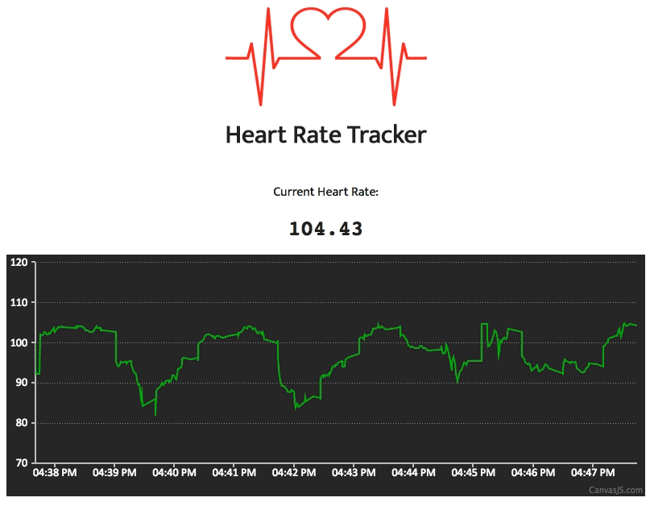

# Real-Time Heart Rate Tracker <br/> built with AT&T M2X, Pusher & Canvas.js

This is a sample application which leverages the [AT&T M2X Time-Series Datastore](https://m2x.att.com) to gather and store heart rate data, and the [M2X Pusher Integration](https://m2x.att.com/developer/documentation/v2/integrations#pusher-sink-integration) to stream data in real-time through a [Pusher](https://pusher.com/) WebSocket Channel to a web application that dispalys the current heart rate & a dynamic chart from [Canvas.js](http://canvasjs.com/html5-javascript-dynamic-chart/).

#### View Live Demo
http://panoply.cloud/heart-rate-tracker/



# Prerequisites

* [AT&T IoT Services](https://m2x.att.com/signup) account
* [Pusher](https://pusher.com/signup) account

# Setup

You will need the following in order to run the application:

1. An M2X Device with a `heart-rate` Stream which is receiving real-time data updates. Don't have one? See: [Data Generation](#data-generation)
2. Configured M2X Pusher Integration to send M2X Device data to Pusher WebSocket channel. Don't have one? See: [Configure M2X Pusher Integration](#configure-m2x-pusher-integration)

## Data Generation

If you don't have an M2X Device seeding live data, we've included a [Python script](bin/hr_datagen.py) that leverages the [M2X Python Client Library](https://github.com/attm2x/m2x-python) to push generated heart rate data to M2X.

The script assumes you have already created an M2X Device and added a Stream called `heart-rate`. Note: the ID of this device will be used when running the script in the `M2X_HR_DEVICE` environment variable.

#### Requirements: 

* `Python 3`
* `pip 3`
* `M2X Python Client` 

To execute the script, run the following commands:

1. Install M2X Python Client:
    ```bash
    pip install m2x
    ```

2. Set environment variables for `M2X_API_KEY` & `M2X_HR_DEVICE`:
    ```bash
    export M2X_API_KEY=[YOUR-M2X-API-KEY]
    export M2X_HR_DEVICE=[YOUR-M2X-DEVICE-ID]
    ```

2. Run the script:
    ```bash
    pyhthon ./bin/hr_datagen.py
    ```

## Configure M2X Pusher Integration

The M2X -> Pusher Integration, once configured, will deliver all data from the configured data sources to Pusher which in turn publishes those data updates to a WebSocket channel which your client applications can subscribe to in order to receive real-time updates.

Create an Integration by making an HTTP request to the [Create Integration](https://m2x.att.com/developer/documentation/integrations#Create-Integration) endpoint of the M2X API. Please refer to the [M2X API documentation](https://m2x.att.com/developer/documentation) when crafting your request, note that the Create Integration endpoint requires an M2X Master API Key in the `X-M2X-KEY` header.

# Install & Run

1. Clone this repository
2. Add your Pusher App ID & Chanel Name to [js/main.js](js/main.js). Note: the channel name is the `channel_prefix` provided when [configuring the M2X Pusher integration](#configure-m2x-pusher-integration) plus the name of the M2X Device Stream. __Example:__ [channel prefix `m2x-`] + [stream name `heart-rate`] = [channel name `m2x-heart-rate`]
3. Open [index.html](index.html) in your browser to view the data streaming in real-time
